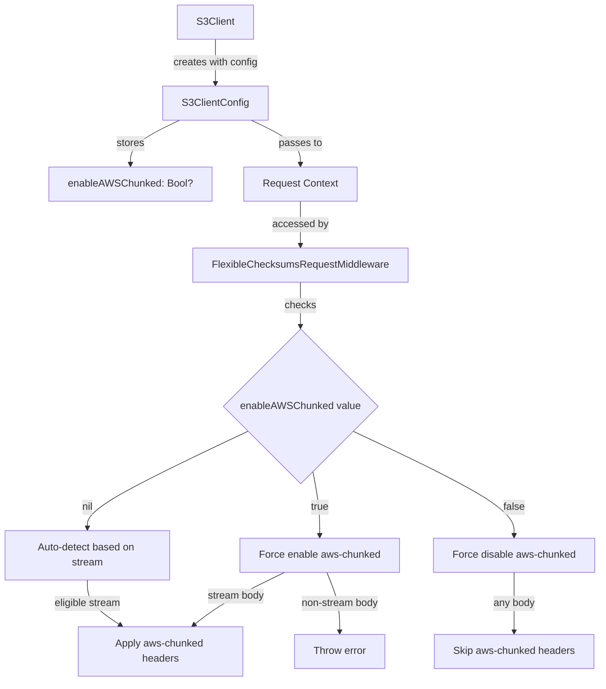

# Design Document: Enable AWS Chunked Configuration

## Overview

This design adds an `enableAWSChunked` configuration option to S3ClientConfiguration, allowing users to explicitly control aws-chunked encoding behavior. The implementation follows the existing pattern used by other S3 configuration options like `forcePathStyle`, `accelerate`, and `useArnRegion`.

The design maintains backward compatibility by using an optional `Bool?` type where `nil` preserves the current auto-detection behavior, `true` forces aws-chunked encoding, and `false` disables it.

## Architecture

### Component Interaction



### Data Flow

1. User creates S3ClientConfig with optional `enableAWSChunked` parameter
2. Configuration is stored in S3ClientConfig struct
3. When a request is made, configuration is propagated to request context
4. FlexibleChecksumsRequestMiddleware reads the configuration from context
5. Middleware applies aws-chunked encoding based on configuration value

## Components and Interfaces

### 1. S3ClientConfig Struct

**Location:** `Sources/Services/AWSS3/Sources/AWSS3/S3Client.swift`

**Modifications:**

Add new property to both `S3ClientConfig` and deprecated `S3ClientConfiguration`:

```swift
public var enableAWSChunked: Swift.Bool?
```

Add parameter to all initializers:

```swift
public init(
    // ... existing parameters ...
    enableAWSChunked: Swift.Bool? = nil,
    // ... remaining parameters ...
) throws {
    // ... existing initialization ...
    self.enableAWSChunked = enableAWSChunked
    // ... remaining initialization ...
}
```

The property should be added after the `disableS3ExpressSessionAuth` property to maintain logical grouping with other S3-specific options.

### 2. Context Extension

**Location:** Create new file or extend existing context utilities

**Purpose:** Provide type-safe access to the `enableAWSChunked` configuration value in the request context.

**Interface:**

```swift
extension Context {
    private static let enableAWSChunkedKey = AttributeKey<Bool?>(name: "EnableAWSChunked")
    
    public var enableAWSChunked: Bool? {
        get {
            return attributes.get(key: Self.enableAWSChunkedKey)
        }
        set {
            attributes.set(key: Self.enableAWSChunkedKey, value: newValue)
        }
    }
}
```

### 3. FlexibleChecksumsRequestMiddleware

**Location:** `Sources/Core/AWSClientRuntime/Sources/AWSClientRuntime/Middlewares/FlexibleChecksumsRequestMiddleware.swift`

**Modifications:**

Update the `addHeaders` method to check the `enableAWSChunked` configuration before applying aws-chunked encoding:

```swift
private func addHeaders(builder: HTTPRequestBuilder, attributes: Context) async throws {
    // ... existing logger initialization ...
    
    // Get the enableAWSChunked configuration
    let enableAWSChunked = attributes.enableAWSChunked
    
    if case(.stream(let stream)) = builder.body {
        attributes.isChunkedEligibleStream = stream.isEligibleForChunkedStreaming
        
        // Determine if aws-chunked should be applied
        let shouldApplyAwsChunked: Bool
        if let enableAWSChunked = enableAWSChunked {
            // Explicit configuration takes precedence
            shouldApplyAwsChunked = enableAWSChunked
        } else {
            // Fall back to auto-detection
            shouldApplyAwsChunked = stream.isEligibleForChunkedStreaming
        }
        
        if shouldApplyAwsChunked {
            try builder.setAwsChunkedHeaders() // x-amz-decoded-content-length
        }
    } else if case(.noStream) = builder.body {
        // Check if user tried to force enable aws-chunked with non-stream body
        if enableAWSChunked == true {
            throw ClientError.dataNotFound("Cannot enable aws-chunked encoding: request body is not a stream")
        }
        logger.debug("Request body is empty. Skipping request checksum calculation...")
        return
    } else if case(.data) = builder.body {
        // Check if user tried to force enable aws-chunked with data body
        if enableAWSChunked == true {
            throw ClientError.dataNotFound("Cannot enable aws-chunked encoding: request body is not a stream")
        }
    }
    
    // ... rest of existing checksum logic ...
}
```

### 4. Configuration Propagation

**Location:** Operation-specific code generation or middleware setup

The `enableAWSChunked` configuration needs to be propagated from S3ClientConfig to the request context. This follows the same pattern as `requestChecksumCalculation`:

```swift
.withEnableAWSChunked(value: config.enableAWSChunked)
```

This will be added to the context builder chain in the generated operation code.

## Data Models

### Configuration Value Semantics

| Value | Behavior | Use Case |
|-------|----------|----------|
| `nil` (default) | Auto-detect based on `stream.isEligibleForChunkedStreaming` | Default behavior, maintains backward compatibility |
| `true` | Force enable aws-chunked encoding | User wants aws-chunked regardless of stream eligibility |
| `false` | Force disable aws-chunked encoding | User wants to disable aws-chunked even for eligible streams |

### Error Conditions

| Condition | Error Type | Error Message |
|-----------|-----------|---------------|
| `enableAWSChunked = true` with non-stream body | `ClientError.dataNotFound` | "Cannot enable aws-chunked encoding: request body is not a stream" |
| `enableAWSChunked = true` with `.noStream` | `ClientError.dataNotFound` | "Cannot enable aws-chunked encoding: request body is not a stream" |
| `enableAWSChunked = true` with `.data` | `ClientError.dataNotFound` | "Cannot enable aws-chunked encoding: request body is not a stream" |

## Correctness Properties

*A property is a characteristic or behavior that should hold true across all valid executions of a system—essentially, a formal statement about what the system should do. Properties serve as the bridge between human-readable specifications and machine-verifiable correctness guarantees.*


### Property 1: Configuration Storage Round-Trip

*For any* Bool? value (nil, true, or false), when set as `enableAWSChunked` in S3ClientConfig, retrieving the property should return the same value.

**Validates: Requirements 1.4**

### Property 2: Configuration Propagation

*For any* Bool? value set in S3ClientConfig's `enableAWSChunked`, when a request is initialized, the request context should contain the same value.

**Validates: Requirements 2.1**

### Property 3: Force Enable Applies AWS-Chunked

*For any* request with a stream body, when `enableAWSChunked` is `true`, the middleware should set aws-chunked headers (Content-Encoding: aws-chunked, Transfer-Encoding: chunked, X-Amz-Decoded-Content-Length).

**Validates: Requirements 3.1, 3.2**

### Property 4: Force Enable With Non-Stream Throws Error

*For any* request with a non-stream body (data or noStream), when `enableAWSChunked` is `true`, the middleware should throw a ClientError indicating that aws-chunked encoding requires a streaming payload.

**Validates: Requirements 3.3, 7.1**

### Property 5: Force Disable Prevents AWS-Chunked

*For any* request (regardless of body type or stream eligibility), when `enableAWSChunked` is `false`, the middleware should not set aws-chunked headers.

**Validates: Requirements 4.1, 4.2**

### Property 6: Checksums Work Without AWS-Chunked

*For any* request with `enableAWSChunked` set to `false`, when checksums are required, the middleware should calculate and apply checksums without using aws-chunked encoding.

**Validates: Requirements 4.3**

### Property 7: Auto-Detection Matches Stream Eligibility

*For any* request with `enableAWSChunked` set to `nil`, the middleware should apply aws-chunked headers if and only if the stream's `isEligibleForChunkedStreaming` property is true.

**Validates: Requirements 5.1, 5.2, 5.3**

### Property 8: Backward Compatibility

*For any* request where `enableAWSChunked` is not specified (nil), the system behavior should be identical to the behavior before this feature was added (auto-detection based on stream eligibility).

**Validates: Requirements 6.1**

### Property 9: Error Message Content

*For any* error thrown when `enableAWSChunked` is `true` with a non-stream body, the error message should contain text indicating that aws-chunked encoding requires a streaming payload.

**Validates: Requirements 7.2**

### Property 10: Errors Halt Execution

*For any* error thrown during middleware processing, the request should not proceed to subsequent middleware or execution stages.

**Validates: Requirements 7.3**

## Error Handling

### Error Scenarios

1. **Force Enable with Non-Stream Body**
   - **Condition:** `enableAWSChunked = true` and body is `.data` or `.noStream`
   - **Error:** `ClientError.dataNotFound`
   - **Message:** "Cannot enable aws-chunked encoding: request body is not a stream"
   - **Recovery:** User must either change to streaming body or set `enableAWSChunked` to `nil` or `false`

2. **Invalid Configuration Combination**
   - **Condition:** User attempts to use aws-chunked with operations that don't support streaming
   - **Error:** Caught early by the non-stream body check
   - **Recovery:** User should review operation documentation and use appropriate body type

### Error Handling Strategy

- Fail fast: Validate configuration before processing request
- Clear messages: Provide actionable error messages that explain the constraint
- Type safety: Use Swift's type system to prevent invalid configurations at compile time where possible
- Graceful degradation: When `enableAWSChunked = false`, continue with normal checksum processing

## Testing Strategy

### Unit Tests

Unit tests will verify specific examples and edge cases:

1. **Configuration Storage**
   - Test that `enableAWSChunked` can be set to `nil`, `true`, and `false`
   - Test that default value is `nil` when not specified
   - Test that value is preserved through initialization

2. **Context Propagation**
   - Test that `nil` value propagates to context
   - Test that `true` value propagates to context
   - Test that `false` value propagates to context

3. **Error Cases**
   - Test error thrown when `enableAWSChunked = true` with `.data` body
   - Test error thrown when `enableAWSChunked = true` with `.noStream` body
   - Test error message contains expected text

4. **Edge Cases**
   - Test with empty stream
   - Test with non-seekable stream
   - Test with seekable stream
   - Test interaction with flexible checksums

### Property-Based Tests

Property-based tests will verify universal properties across all inputs. Each test should run a minimum of 100 iterations.

1. **Property Test: Configuration Round-Trip**
   - **Property:** Property 1
   - **Tag:** Feature: enable-aws-chunked-config, Property 1: Configuration storage round-trip
   - **Generator:** Generate random Bool? values (nil, true, false)
   - **Test:** Set value in config, retrieve it, verify equality

2. **Property Test: Configuration Propagation**
   - **Property:** Property 2
   - **Tag:** Feature: enable-aws-chunked-config, Property 2: Configuration propagation
   - **Generator:** Generate random Bool? values and mock request contexts
   - **Test:** Set value in config, initialize request, verify context contains same value

3. **Property Test: Force Enable Applies Headers**
   - **Property:** Property 3
   - **Tag:** Feature: enable-aws-chunked-config, Property 3: Force enable applies aws-chunked
   - **Generator:** Generate random stream bodies with various properties
   - **Test:** Set enableAWSChunked=true, verify aws-chunked headers are present

4. **Property Test: Force Enable Error Handling**
   - **Property:** Property 4
   - **Tag:** Feature: enable-aws-chunked-config, Property 4: Force enable with non-stream throws error
   - **Generator:** Generate random non-stream bodies (data, noStream)
   - **Test:** Set enableAWSChunked=true, verify error is thrown

5. **Property Test: Force Disable Prevents Headers**
   - **Property:** Property 5
   - **Tag:** Feature: enable-aws-chunked-config, Property 5: Force disable prevents aws-chunked
   - **Generator:** Generate random request bodies (stream, data, noStream)
   - **Test:** Set enableAWSChunked=false, verify aws-chunked headers are not present

6. **Property Test: Checksums Without AWS-Chunked**
   - **Property:** Property 6
   - **Tag:** Feature: enable-aws-chunked-config, Property 6: Checksums work without aws-chunked
   - **Generator:** Generate random requests with checksum requirements
   - **Test:** Set enableAWSChunked=false, verify checksums are calculated and applied

7. **Property Test: Auto-Detection**
   - **Property:** Property 7
   - **Tag:** Feature: enable-aws-chunked-config, Property 7: Auto-detection matches stream eligibility
   - **Generator:** Generate random streams with varying eligibility
   - **Test:** Set enableAWSChunked=nil, verify headers match stream.isEligibleForChunkedStreaming

8. **Property Test: Backward Compatibility**
   - **Property:** Property 8
   - **Tag:** Feature: enable-aws-chunked-config, Property 8: Backward compatibility
   - **Generator:** Generate random requests
   - **Test:** Compare behavior with enableAWSChunked=nil to original implementation

### Integration Tests

Integration tests will verify end-to-end behavior:

1. **S3 Upload with Force Enable**
   - Create S3Client with `enableAWSChunked = true`
   - Upload a file using streaming
   - Verify request includes aws-chunked headers

2. **S3 Upload with Force Disable**
   - Create S3Client with `enableAWSChunked = false`
   - Upload a file using streaming
   - Verify request does not include aws-chunked headers

3. **S3 Upload with Auto-Detect**
   - Create S3Client with `enableAWSChunked = nil`
   - Upload a file using streaming
   - Verify behavior matches current implementation

### Test Configuration

- **Property Test Library:** Swift Testing framework with custom property-based testing utilities, or swift-check if available
- **Minimum Iterations:** 100 per property test
- **Test Isolation:** Each test should be independent and not rely on shared state
- **Mock Strategy:** Use protocol-based mocking for HTTPRequestBuilder and Context
- **Assertion Strategy:** Use XCTest assertions for unit tests, property-based assertions for property tests

## Implementation Notes

### Code Generation Considerations

Since S3Client.swift is generated code (indicated by the "Code generated by smithy-swift-codegen. DO NOT EDIT!" comment), the implementation will need to:

1. Update the Smithy code generator to include the `enableAWSChunked` property
2. Ensure the property is added to both `S3ClientConfig` and deprecated `S3ClientConfiguration`
3. Add the property to all initializer variants (sync, async, region-based)
4. Include the property in the `toSendable()` conversion method

### Backward Compatibility Strategy

- Default value of `nil` ensures existing code behavior is unchanged
- Optional parameter in initializers means existing code compiles without modification
- Auto-detection logic remains as fallback when configuration is not specified

### Performance Considerations

- No performance impact when `enableAWSChunked = nil` (default)
- Minimal overhead for boolean check when explicitly configured
- No additional memory allocation beyond the Bool? storage

### Security Considerations

- No security implications from this configuration option
- Does not affect authentication or authorization
- Does not expose sensitive information
- Maintains existing security properties of aws-chunked encoding
